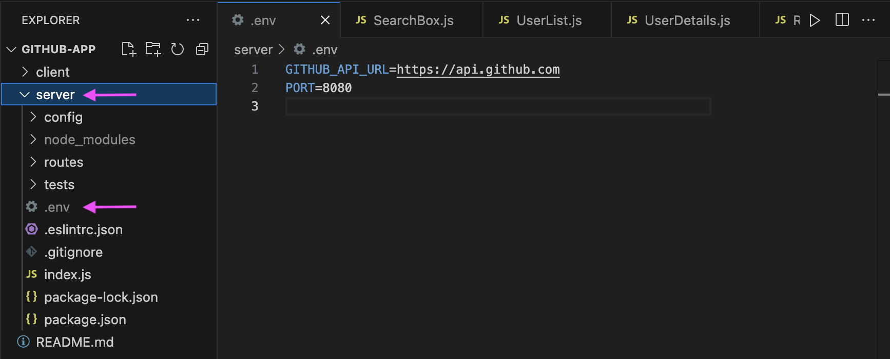

# GitHub App


## Table of Contents
- [Description](#description)
- [Project Structure](#project-structure)
- [Features](#features)
- [Technologies Used](#technologies-used)
- [Prerequisites](#prerequisites)
- [Installation](#installation)
- [Launching the App](#launching-the-app)
- [The Github Endpoints](#the-github-endpoints)
- [Usage](#usage)
- [Components](#components)
- [Creator](#creator)

## Description

This is a fullstack app that allows users to search for GitHub profiles, view detailed information about users, and explore their repositories and latest commits. The app interacts with the GitHub API to fetch and display the necessary data.

All the search-and-fetch functionality is achieved via the GitHub API: https://api.github.com/. In this project we only concern ourselves with publicly accessible API endpoints. 

You can also see how much tokens you have used up by going onto this link https://api.github.com/rate_limit in your browser, you will have a maximum of 60 tokens which will re-set at a certain amount of time.

This is my second project using both React and Express to create a Fullstack application. As such, it required a clear understanding of concepts related to:

- Express
- Restful APIs
- Fetch API (or Axios)
- React
- JavaScript

## Project Structure

This application is divided into two main directories:

1. Client:
- The client directory contains the front-end part of the application. It includes all the code related to the user interface (UI) and user experience (UX), typically built using modern front-end frameworks or libraries such as React, Angular, or Vue.js.
- This part of the application is responsible for interacting with users, capturing input, and displaying data retrieved from the back-end.

2. Server:
- The server directory houses the back-end of the application. It includes the server-side logic, API endpoints, database interactions, and any other operations that occur on the server.
- This part of the application handles requests from the front-end, processes data, communicates with external APIs (like GitHub's API), and returns the necessary data to the front-end for display.

## Features

- **Search for GitHub Users**: Easily search for GitHub users by username.
- **View User Details**: Access detailed information about a selected user.
- **Explore Repositories**: Browse through a user's repositories and see their details.
- **View Commits**: Access the latest commits for a specific repository.
- **Navigate Easily**: Use React Router for smooth navigation between different sections of the app.
- **GitHub API Rate Limiting**: Handle GitHub API rate limits gracefully.

## Technologies Used

- **Frontend**: React.js, React Router, Bootstrap
- **Backend**: Node.js, Express.js
- **API**: GitHub REST API
- **Testing**: Jest, Mocha, Chai, Postman

## Prerequisites

Before you begin, ensure you have the following installed on your system:

- [Node.js](https://nodejs.org/) (version 14.x or later)
- [npm](https://www.npmjs.com/) (version 6.x or later)
- [Git](https://git-scm.com/)
- A `.env` file set up in the `server` directory.

### Setting Up the .env File

To run this project locally, you'll need to create a `.env` file inside the `server` directory with the following content:

**Note:** The `.env` file is not included in this repository for security reasons and best practices. The `GITHUB_API_URL` is a public API endpoint, so it doesn't expose any sensitive information. You can find an example of the `.env` file setup in the screenshot below and how it should look:



## Installation
To install and run the application locally:

### Setup Instructions

1. Clone the repository:
   ```bash
   git clone https://github.com/M311HAN/github_app.git
    ```

2. Navigate to the project directory:
    ```bash
    cd github_app
    ```

3. Install the dependencies:
    ```bash
    # Install server-side dependencies
    cd server
    npm install
    ```

4.  ```bash
    # Install client-side dependencies
    cd client
    npm install
    ```
### Launching the App

### Running the Backend Server
 
1. Navigate to the server directory:
    ```bash
    cd server
    ```

2. Start the server-side with nodemon:
    ```bash
    npm run dev
    ```

The server should now be running on `http://localhost:8080`.

### Running the Frontend

1. Navigate to the client directory:
    ```bash
    cd client
    ```

2. Start the React app:
    ```bash
    npm start
    ```

The frontend should now be running on `http://localhost:3000`.

## The GitHub Endpoints

The application leverages several GitHub API endpoints to retrieve user data and repository information:

1. Get users whose username matches a specific pattern

Endpoint: `/api/search/users?q={username}`

- This endpoint searches for users whose usernames match the specified pattern.
- Example: `/api/search/users?q=octocat`

2. Get data based on a specific username

Endpoint: `/api/users/{username}`

- This endpoint retrieves detailed information about a specific GitHub user.
- Example: `/api/users/octocat`

3. Get information for the latest git commits of a repo

Endpoint: `/api/repos/{owner}/{repo}/commits`

- This endpoint fetches the latest commits from a specified repository.
- Example: `/api/repos/octocat/Hello-World/commits`

4. Get the remaining number of GitHub requests your IP address is allowed to consume

Endpoint: `/rate_limit`

- This endpoint returns the remaining number of GitHub API requests that your IP address can make.
- Example: `/rate_limit`

## Usage
1. Search for a User:

- Use the search bar on the homepage to enter a GitHub username.
- The app will display a list of matching users.

2. View User Details:

- Click on a user's page to view detailed information about the user, including their repositories, dates created and last 5 commits ect.

- For each user, there is a link GitHub Profile that will take you to the GitHub profile for that specific user.

3. Explore Repositories:

- Click on a repository to see its details, including the latest commits.

4. Navigate Back:

- Use the back button to return to the previous page or search for another user.


## Components

- `SearchBox.js`: Input field for searching GitHub users.
- `UserList.js`: Displays the search results.
- `UserDetails.js`: Shows details of a selected user and their repositories.
- `RepoDetails.js`: Displays details of a selected repository, including the last 5 commits.

## Creator

This project is created by Melihhan (https://github.com/M311HAN). [Visit the repository](https://github.com/M311HAN?tab=repositories) for more projects and further collaboration.

Feel free to fork, contribute, or use this project as a reference for your own GitHub API projects!
